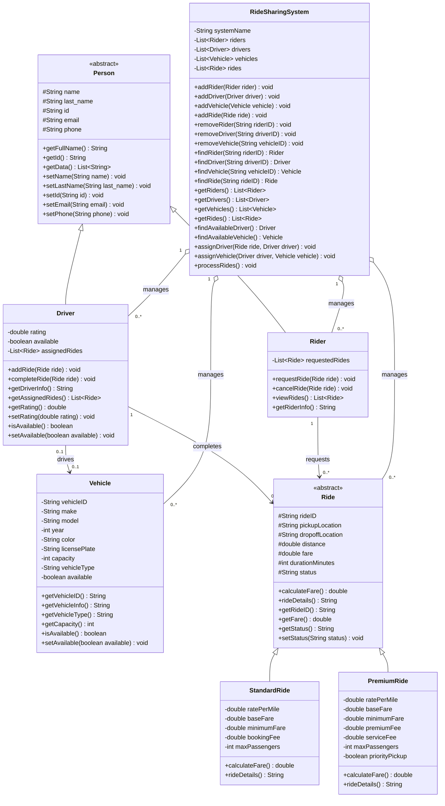

# Ride Sharing System

The Ride Sharing System must include the following components at a minimum. You should add additional functionality and feel free to be creative.

1. Ride Class:
Create a base class Ride that holds core details such as rideID, pickupLocation, dropoffLocation, distance, and fare.
Define methods for calculating the fare() based on distance and a rideDetails() method to display ride information.
2. Specific Ride Subclasses:
Implement at least two derived classes of Ride, such as StandardRide and PremiumRide.
Each subclass should override the fare() method to calculate the fare based on ride type (e.g., premium rides might cost more per mile).
Demonstrate polymorphism by calling the overridden fare() method on a list of different ride types.
3. Driver Class:
Create a Driver class with attributes like driverID, name, rating, and assignedRides, a list of rides completed by the driver.
Include methods such as addRide(Ride ride) to add rides to the driver’s list and getDriverInfo() to display driver details.
Use encapsulation to keep assignedRides private and accessible only through defined methods.
4. Rider Class:
Create a Rider class with attributes like riderID, name, and requestedRides, a list of rides requested by the rider.
Include methods such as requestRide(Ride ride) to add a ride to the rider’s requested list, and viewRides() to display ride history.
5. System Functionality
Demonstrate polymorphism by storing rides of different types in a list (array or collection) and invoking fare() and rideDe- tails() polymorphically.

## Class Diagram

